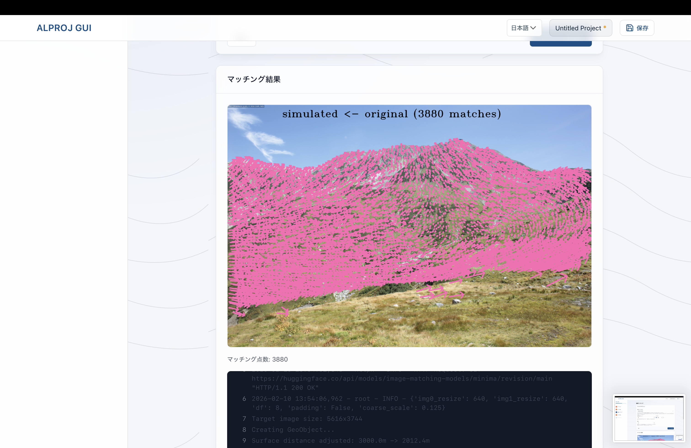
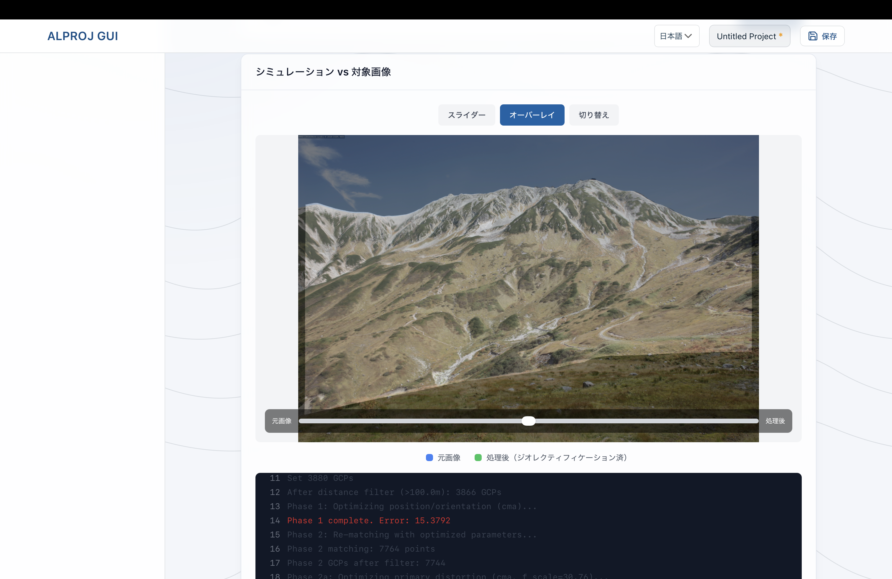
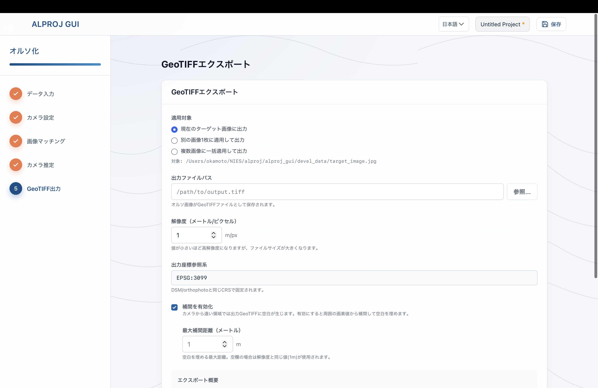

# ALPROJ GUI


A desktop application for georectifying ground-based mountain photographs using Digital Surface Models (DSM) and aerial imagery. It produces georeferenced GeoTIFF outputs (ortho image) suitable for GIS analysis.  

DSM（数値表層モデル）と航空写真を使って地上撮影の山岳写真を幾何補正し、GISで利用できる位置情報付きGeoTIFF（オルソ画像）を作成するデスクトップアプリです。

## Overview

ALPROJ GUI provides a wizard-style interface for transforming mountain photographs into geographically referenced images. The application guides users through:

1. **Data Input** - Loading DSM, aerial orthophotos, and target mountain photos
2. **Camera Parameter Setup** - Interactive map-based configuration of camera position, direction, and field of view
3. **Processing** - Automated image matching and camera parameter optimization
4. **Export** - Generating GeoTIFF files with embedded coordinate information

The core georectification processing is powered by [`alproj`](https://github.com/0kam/alproj), a Python package developed by me.  
Documentation: [alproj.readthedocs.io](https://alproj.readthedocs.io/en/latest/)

### 概要

ALPROJ GUI は、山岳写真をオルソ化するためのウィザード形式アプリです。主な流れは次のとおりです。

1. **データ入力** - DSM、オルソ画像、対象写真を読み込む
2. **カメラパラメータ設定** - 地図上で位置・向き・画角を設定する
3. **処理** - 画像マッチングとカメラパラメータ最適化を実行する
4. **出力** - 座標情報付きGeoTIFFを生成する

コアとなる幾何補正処理には、私が開発している Python パッケージ [`alproj`](https://github.com/0kam/alproj) を利用しています。  
ドキュメント: [alproj.readthedocs.io](https://alproj.readthedocs.io/ja/latest/)

## 動作要件

- 最低要件:
  - RAM 16GB 以上
- 快適な利用の目安:
  - RAM 32GB 以上
  - 高性能な CPU
    - 開発環境: AMD Ryzen 5 8600G、Apple M4 pro
    - Intel の場合: 第13世代 Core i5 以上を推奨

性能の低い CPU を使用している場合、画像マッチングやカメラパラメータ最適化がタイムアウトすることがあります。

## 使い方

### 1. データ入力

DSM、オルソ化された航空写真/衛星画像、対象となる景観写真を読み込みます。
CRSは必ずm単位のもの（UTM推奨）を使い、DSMと航空写真で揃うようにしてください。
航空写真は高解像度の衛星画像でも代用可能です。景観写真と近い時期のものを用いることをお勧めします。


### 2. カメラ設定とシミュレーション確認

地図上でカメラ位置・向き、画角を設定します。続いてシミュレーション画像を生成し、対象画像との見え方を確認します（ある程度近くなるまで調整してください）。


### 3. 画像マッチング

手法と閾値などを設定して景観写真とシミュレーション画像の間で実行し、対応点を取得します。



### 4. カメラパラメータ推定

取得された対応点をもとに、カメラパラメータを最適化します。
最適化後のパラメータで作成したシミュレーション画像と景観写真を重ね、ずれがないことを確認します




### 5. GeoTIFF出力

出力対象・解像度・座標系などを設定して GeoTIFF を生成します。生成後は地図プレビューで位置合わせ結果を確認できます。

定点カメラなど同一条件で撮影された写真がある場合は、推定したカメラパラメータを用いたオルソ化を複数の画像に対して適用することも可能です。




### 6. プロジェクト保存

右上の保存ボタンから `.alproj` を保存できます。作業を再開する場合は保存済みプロジェクトを開いてください。

## Installation

Download the latest release from the [Releases](../../releases) page.

### macOS

1. Download the `.dmg` file:
   - **Apple Silicon (M1/M2/M3)**: `ALPROJ.GUI_x.x.x_aarch64.dmg`
   - Intel macOS build is not provided in the current release workflow.

2. Open the `.dmg` and drag the app to Applications folder

3. **First launch** (app is not code-signed):
   - Right-click the app → Select **Open**
   - Click **Open** in the dialog

   Or via Terminal:
   ```bash
   xattr -cr /Applications/ALPROJ\ GUI.app
   ```

### Windows

1. Download `ALPROJ.GUI_x.x.x_x64-setup.exe`

2. Run the installer

3. **First launch** (app is not code-signed):
   - If SmartScreen appears, click **More info**
   - Click **Run anyway**

### Linux

1. Download `ALPROJ.GUI_x.x.x_linux_x86_64.tar.gz`

2. Extract and install:
   ```bash
   tar -xzf ALPROJ.GUI_x.x.x_linux_x86_64.tar.gz
   cd alproj-gui-linux-x86_64
   ./install.sh
   ```

### インストール手順

最新版は [Releases](../../releases) から取得してください。

#### macOS

1. `.dmg` をダウンロード
   - **Apple Silicon (M1/M2/M3)**: `ALPROJ.GUI_x.x.x_aarch64.dmg`
   - 現在のリリースワークフローでは Intel Mac 向けビルドは提供していません。
2. `.dmg` を開き、アプリを `Applications` にドラッグ
3. 初回起動（未署名アプリ）:
   - アプリを右クリックして **開く**
   - ダイアログで **開く** を選択
   - 必要に応じて以下を実行:
   ```bash
   xattr -cr /Applications/ALPROJ\ GUI.app
   ```

#### Windows

1. `ALPROJ.GUI_x.x.x_x64-setup.exe` をダウンロード
2. インストーラーを実行
3. 初回起動時に SmartScreen が表示されたら **詳細情報** → **実行**

#### Linux

1. `ALPROJ.GUI_x.x.x_linux_x86_64.tar.gz` をダウンロード
2. 展開してインストール:
   ```bash
   tar -xzf ALPROJ.GUI_x.x.x_linux_x86_64.tar.gz
   cd alproj-gui-linux-x86_64
   ./install.sh
   ```

---


## Tech Stack

### Frontend
- **SvelteKit** - Web application framework
- **Svelte 4** - UI component framework
- **TypeScript 5** - Type-safe JavaScript
- **Tailwind CSS 3** - Utility-first CSS framework
- **MapLibre GL** - Interactive map rendering
- **Vite 5** - Build tool and dev server

### Backend
- **Python 3.11** - Runtime environment
- **FastAPI** - Async web framework
- **Pydantic 2** - Data validation
- **uvicorn** - ASGI server
- **[alproj](https://github.com/0kam/alproj)** - Core georectification library
- **rasterio** - Geospatial raster I/O
- **OpenCV** - Image processing
- **NumPy** - Numerical computing

### Desktop
- **Tauri 2** - Desktop application framework
- **Rust** - Backend runtime for Tauri

### Package Managers
- **uv** - Python package manager
- **npm** - Node.js package manager
- **Cargo** - Rust package manager

## Project Structure

```
alproj_gui/
├── backend/           # FastAPI backend (Python)
│   ├── app/           # Application code
│   └── .venv/         # Virtual environment
├── frontend/          # SvelteKit frontend (TypeScript)
│   └── src/           # Source code
├── src-tauri/         # Tauri desktop app (Rust)
│   └── binaries/      # Sidecar binaries
├── scripts/           # Development scripts
├── devel_data/        # Sample data for development
└── specs/             # Feature specifications
```

## Development Setup

### Prerequisites

- [Node.js](https://nodejs.org/) (v20+)
- [uv](https://github.com/astral-sh/uv) (Python package manager)
- [Rust](https://rustup.rs/) (for Tauri builds)

### Running in Development Mode (Browser)

The easiest way to start both servers:

```bash
./scripts/dev.sh
```

Or start them separately:

```bash
# Backend (port 8765)
cd backend && uv run uvicorn app.main:app --reload --port 8765

# Frontend (port 5173)
cd frontend && npm run dev
```

**URLs:**
- Frontend: http://localhost:5173
- Backend API docs: http://localhost:8765/docs

### Running as Tauri Desktop App

For development with hot reload (run from project root):

```bash
cargo tauri dev
```

This automatically starts both the frontend and backend servers.

## Building for Production

### Build the Tauri Desktop App

1. **Build the Python backend sidecar** (required before release build):

   ```bash
   ./scripts/build-sidecar.sh
   ```

   This creates a standalone executable from the Python backend using PyInstaller.

2. **Build the Tauri application** (run from project root):

   ```bash
   cargo tauri build
   ```

   The built application will be in `src-tauri/target/release/bundle/`.

### Platform-specific Notes

- **macOS**: Minimum version 10.15 (Catalina)
- **Linux**: Requires `libwebkit2gtk-4.1-0` and `libgtk-3-0`
- **Windows**: Built as MSVC target

## Code Quality

### Type Checking & Linting

```bash
# Frontend
cd frontend && npm run check && npm run lint

# Backend
cd backend && uv run mypy . && uv run ruff check .
```

### Testing

```bash
# Backend
cd backend && uv run pytest

# Frontend
cd frontend && npm run test
```

## License

GNU General Public License v3.0 (GPL-3.0)
